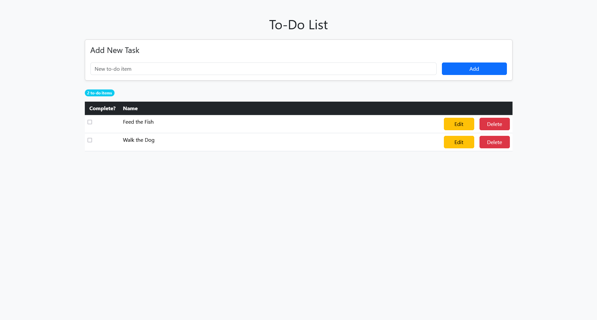
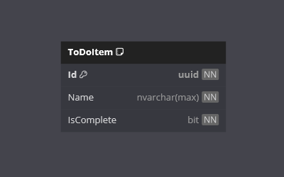

	
	<h1>To-Do List</h1>

Welcome to the **To-Do List** App!

This is a .NET project designed to demonstrate combining Minimal APIs with JavaScript Fetch in a single-page application.

It allows users to view and record their to-do list items, and mark them as complete.

## Features

- **To-Do List**: Create, view, update and delete items on your to-do list.
- **Responsive Design**: A user-friendly interface designed to work on various devices.

## Technologies

- .NET
- ASP.NET MVC
- Entity Framework Core
- SQL Server
- Bootstrap
- HTML
- CSS
- JavaScript

## Getting Started

### Prerequisites

- .NET 8 SDK.
- A code editor like Visual Studio or Visual Studio Code.

### Installation

1. Clone the repository:
	- `git clone https://github.com/chrisjamiecarter/to-do-list.git`

2. Navigate to the project directory:
	- `cd src\to-do-list\ToDoList.Web`

3. Build the application using the .NET CLI:
	- `dotnet build`

### Running the Application

1. Run the application using the .NET CLI in the project directory:
	- `dotnet run`

## Usage

Once the application is running, you can:

- View you current To-Do List items.
- Create a new To-Do List item.
- Update/Delete a To-Do List item.

### Home Page

## How It Works

- **Menu Navigation**: Uses a single page view so no users navigation is required for this application.
- **Data Storage**: An In-Memory database is created, so data persistence is scoped to the lifetime of the application.
- **Data Access**: Interaction with the database is via Entity Framework Core.
- **Data Controller**: Minimal APIs are used to control the CRUD operations for the data.
- **Controller Access**: JavaScript Fetch is used to call the API in the web application.
- **Web Page Layout**: Bootstrap is used to style the layout of the web pages.

## Database

## Contributing

Contributions are welcome! Please fork the repository and create a pull request with your changes. For major changes, please open an issue first to discuss what you would like to change.

## License

This project is licensed under the MIT License. See the [LICENSE](./LICENSE) file for details.

## Contact

For any questions or feedback, please open an issue.

---
***Happy To-Do Listing!***
